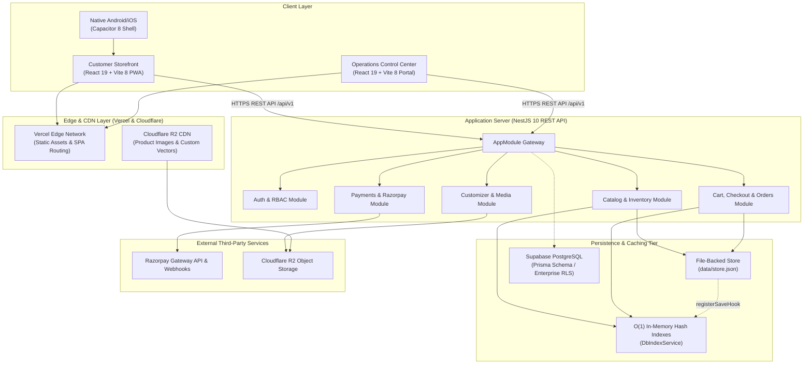
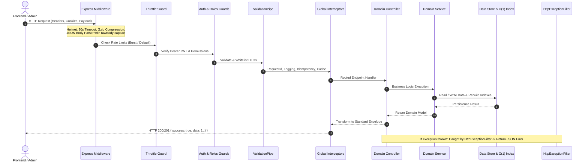
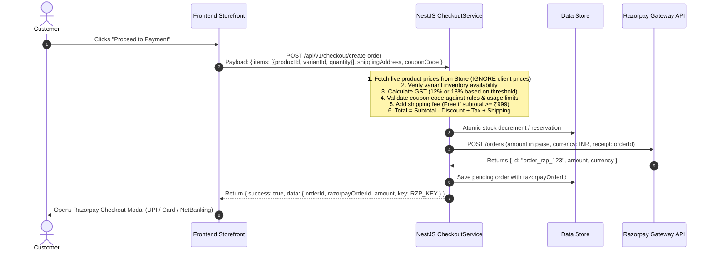
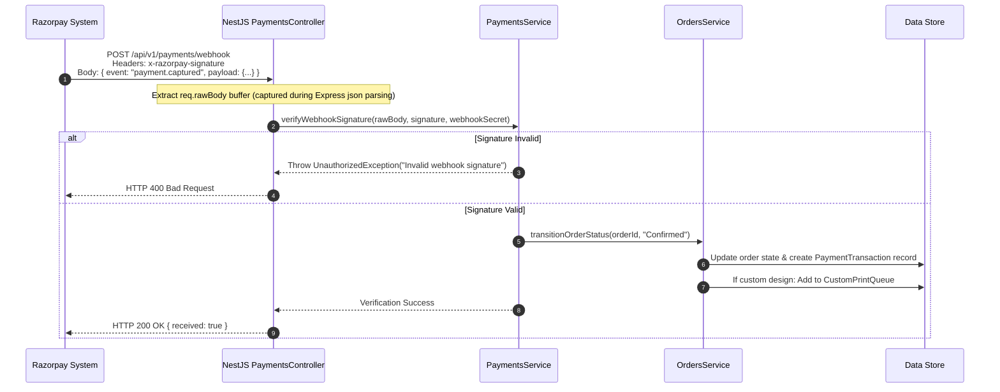
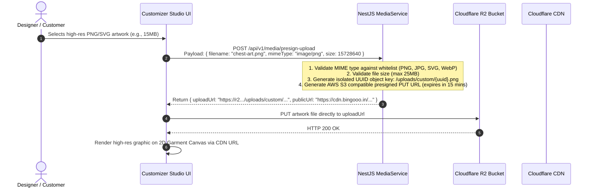

# 🏛️ BINGOOO — Technical System Architecture (`architecture.md`)

> **Document Version:** 1.0.0  
> **Status:** Active Reference Architecture  
> **Last Updated:** September 2026  
> **Target Audience:** Lead Architects, Backend/Frontend Engineers, AI Agents  
> **Scope:** Monorepo (`apps/frontend`, `apps/admin`, `apps/backend`, `packages/types`, `packages/config`, `android/`)

---

## 1. High-Level System Topology

Bingooo is engineered as a modular TypeScript monorepo providing high cohesion, decoupled operational domains, and shared type definitions.



---

## 2. Monorepo Structure & Package Hierarchy

```
bingooo/
├── apps/
│   ├── frontend/         # Customer Storefront & Real-time Customizer Studio
│   │   ├── src/
│   │   │   ├── app/      # Router (32 routes), App shell, Lazy loader
│   │   │   ├── components/ # Atomic UI, ProductCard, CartDrawer, Canvas
│   │   │   ├── hooks/    # useCart, useAuth, useDebounce, useHaptics
│   │   │   ├── lib/      # API client, Capacitor bridge, SEO schemas
│   │   │   ├── pages/    # 32 customer-facing page views
│   │   │   ├── store/    # Zustand stores (cart, auth, customizer, wishlist)
│   │   │   └── styles/   # Tailwind CSS 3.4 tokens, typography, theme
│   │   └── android/      # Capacitor 8 native Android wrapper
│   │
│   ├── admin/            # 27-Route Back-Office Operations Center
│   │   ├── src/
│   │   │   ├── app/      # Admin Router, Layout, Route error boundary
│   │   │   ├── components/ # AdminSidebar (7 divisions), StatCard, Modals
│   │   │   ├── pages/    # Dashboard, ProductEditor, Orders, Settings...
│   │   │   └── store/    # Admin Zustand state & session management
│   │
│   └── backend/          # High-Performance NestJS REST API Server
│       ├── src/
│       │   ├── common/   # Database store, O(1) indexes, Guards, Filters
│       │   ├── auth/     # Supabase Auth, JWT verification, Guards
│       │   ├── products/ # Garment catalog & variant SKU management
│       │   ├── inventory/# Stock allocation & warehouse tracking
│       │   ├── cart/     # Server-validated guest and user shopping bags
│       │   ├── checkout/ # Authoritative price calculation engine
│       │   ├── orders/   # 6-stage order fulfillment state machine
│       │   ├── payments/ # Razorpay SDK, Webhook HMAC verification
│       │   ├── customizations/ # Design specifications & print jobs
│       │   ├── media/    # Cloudflare R2 presigned upload generation
│       │   └── main.ts   # Express bootstrapper, Helmet, Pipes, Swagger
│
├── packages/
│   ├── types/           # Shared TypeScript domain contracts & DTOs
│   │   └── src/         # product.ts, order.ts, cart.ts, customization.ts...
│   └── config/          # Shared ESLint, TSConfig, and build configurations
│
├── prisma/
│   └── schema.prisma    # 58KB+ Enterprise PostgreSQL schema definitions
├── supabase/            # Supabase migrations, seed data, and RLS policies
└── graphify-out/        # Graphify Knowledge Graph persistent code intelligence
```

---

## 3. Frontend Architecture (`apps/frontend`)

### 3.1 Routing & Code-Splitting
The frontend utilizes `react-router-dom` (v7) with route-level code splitting via a custom `lazyPage` utility:
- **Core Immediate Routes:** `HomePage`, `LoginPage`, `SignupPage`, `ForgotPasswordPage`, `ResetPasswordPage` (bundled in main chunk for immediate LCP).
- **Lazy-Loaded Route Chunks:** `ShopPage`, `ProductPage`, `CustomizerPage`, `CartPage`, `CheckoutPage`, `AccountPage`, `OrderDetailPage`, `PoliciesPage`, etc., loaded asynchronously with skeleton placeholders.
- **Cannibalization Resolvers:** Single-hop redirects for legacy or ambiguous slugs (e.g., `/custom → /customize`, `/about-us → /about`, `/privacy → /privacy-policy`).

### 3.2 State Management Architecture
Frontend state is partitioned into distinct Zustand stores:
1. **`useCartStore`:** Manages client-side cart items, drawer open/close states, coupon applications, and local storage persistence. Automatically synchronizes with server-side cart when user logs in.
2. **`useAuthStore`:** Manages user profile, JWT session tokens, Supabase session subscribers, and address books.
3. **`useCustomizerStore`:** Maintains the active 2D garment canvas state:
   - Selected garment silhouette and base color.
   - Front vs. Back active view toggle.
   - Vector/raster artwork layers (x, y, scale, rotation, layer index).
   - Typography text objects (text, font family, size, letter spacing, arc curvature, fill color).
   - Craftsmanship print technique (DTG, DTF, High-Density Embroidery).
   - Dynamic real-time calculated surcharge.
4. **`useWishlistStore`:** Synchronized saved garment list.
5. **`useRecentlyViewedStore`:** Client-side LRU cache of browsed garments.

### 3.3 Real-Time Customizer Canvas Engine
```
[User Input: Text / SVG / Image]
          │
          ▼
┌───────────────────────────────┐
│ useCustomizerStore State Tree │
└──────────────┬────────────────┘
               │
               ▼
┌────────────────────────────────────────────────────────┐
│ GarmentCanvas2D Component                              │
│ ├─ Base Garment Silhouette Layer (SVG/PNG)             │
│ ├─ Printable Boundary Mask (Chest/Back/Sleeve bounds)  │
│ ├─ Transform Matrix (Drag, Pinch-Zoom, Rotation Angle) │
│ └─ Render Layer Stack (Text + Graphics)                │
└──────────────┬─────────────────────────────────────────┘
               │
               ▼
┌────────────────────────────────────────────────────────┐
│ Export & Pricing Pipeline                              │
│ ├─ High-Res Canvas Rasterization (PNG/SVG)             │
│ ├─ Artwork Area Metric Calculation (Sq. Inches)        │
│ ├─ Print Technique Cost Addition (DTG / Embroidery)    │
│ └─ Presigned R2 Direct Upload Payload                  │
└────────────────────────────────────────────────────────┘
```

### 3.4 Native Mobile Bridge (`capacitorBridge.ts`)
When running within Capacitor native mobile containers (Android / iOS):
- **Haptic Feedback:** `triggerHaptic('light' | 'medium' | 'heavy' | 'selection')` interfaces with `@capacitor/haptics`.
- **Status Bar:** Dynamic color matching (`#FAF8F5` light vs. `#171717` dark) via `@capacitor/status-bar`.
- **App Lifecycle:** Deep link interceptors handling payment callback URLs (`bingooo://payment/success`).

---

## 4. Admin Operations Architecture (`apps/admin`)

### 4.1 Route & Layout Hierarchy
The admin portal provides 27 management routes grouped into 7 functional divisions:
1. **Overview:** `/dashboard` (Executive KPI telemetry and sales velocity).
2. **Catalog & Stock:** `/products`, `/products/new`, `/products/:id/edit`, `/categories`, `/inventory`.
3. **Orders & Studio:** `/orders`, `/orders/:id`, `/customizer` (Artwork review queue).
4. **Marketing & Sales:** `/banners`, `/coupons`.
5. **Finance & Media:** `/payments`, `/returns`, `/uploads` (Cloudflare R2 browser).
6. **Customers & Team:** `/customers`, `/reviews`.
7. **Operations & System:** `/settings`.

### 4.2 Product SKU Matrix Generator
In `ProductEditorPage.tsx`, creating or editing garments triggers an automated variant matrix generator:
- Inputs: List of Sizes (`['S', 'M', 'L', 'XL', 'XXL']`) × List of Colors (`['Black', 'White', 'Sand', 'Stone Grey']`).
- Output: Cartesian product generating unique SKUs (e.g., `BG-TEE-OVR-BLK-M`) with independent stock counts, barcode trackers, and pricing overrides.

### 4.3 Route Guards & Role-Based Access Control (RBAC)
- **`AdminGuard`:** Enforces authenticated session check with the NestJS backend.
- Role checks prevent staff members with restricted roles (e.g., Support vs. Warehouse vs. Super Admin) from modifying critical store settings or issuing unauthorized financial refunds.

---

## 5. Backend Server Architecture (`apps/backend`)

### 5.1 NestJS Modular Composition
`AppModule` coordinates 24 specialized domain modules:
- **Core Infrastructure:** `ConfigModule`, `ThrottlerModule`, `HealthModule`.
- **Identity & Security:** `AuthModule`, `UsersModule`, `RolesModule`, `AuditModule`.
- **Catalog Management:** `ProductsModule`, `CategoriesModule`, `CollectionsModule`, `InventoryModule`.
- **Commerce & Fulfillment:** `CartModule`, `WishlistModule`, `CheckoutModule`, `OrdersModule`, `ShippingModule`, `CouponsModule`, `ReturnsModule`.
- **Custom Atelier:** `CustomizationsModule`, `MediaModule`.
- **Engagement & Marketing:** `ReviewsModule`, `NotificationsModule`, `BannersModule`.
- **Administration:** `AdminModule`.

### 5.2 Request Lifecycle Pipeline



### 5.3 Dual Database & Indexing Architecture

#### 1. In-Memory Store with O(1) Hash Indexes (`store.ts` + `db-index.service.ts`)
- **Primary Fast Storage:** In-memory object graph deserialized from `data/store.json` during boot.
- **O(1) Hash Lookup Maps:**
  - `productsById`: `Map<string, Product>`
  - `productsBySlug`: `Map<string, Product>`
  - `categoriesById`: `Map<string, Category>`
  - `ordersById`: `Map<string, Order>`
  - `usersById`: `Map<string, User>`
- **Decoupled Observer Pattern (Strict Invariant):**
  To prevent circular dependency errors (`store.ts` ↔ `db-index.service.ts`), `store.ts` exposes a hook registration mechanism:
  ```typescript
  // store.ts does NOT import db-index.service.ts
  export function registerSaveHook(hook: () => void | Promise<void>) {
    saveHooks.push(hook);
  }
  ```
  `DbIndexService` registers its `rebuildIndexes()` method during module initialization.

#### 2. Enterprise Relational Database (`prisma/schema.prisma` & Supabase)
- Contains 58KB+ comprehensive schema covering PostgreSQL models:
  `User`, `Role`, `Product`, `ProductVariant`, `Category`, `Collection`, `InventoryRecord`, `Cart`, `CartItem`, `Order`, `OrderItem`, `Customization`, `ArtworkAsset`, `PaymentTransaction`, `Refund`, `Coupon`, `Review`, `AuditLog`.
- Enables full ACID compliance, Row-Level Security (RLS), and automated database migrations.

---

## 6. Critical Integration Sequences

### 6.1 Order Creation & Authoritative Pricing Recalculation



### 6.2 Razorpay Webhook Verification & Order Fulfillment



### 6.3 Artwork Upload via Cloudflare R2 Presigned URLs



---

## 7. Deployment & Infrastructure Architecture

| Service | Environment | Provider | Configuration / Entrypoint |
|:---|:---|:---|:---|
| **Customer Storefront** | Production / Staging | Vercel Edge | `apps/frontend/vite.config.ts`, `vercel.json` |
| **Admin Operations** | Production / Staging | Vercel Edge | `apps/admin/vite.config.ts`, Port 5174 local |
| **Backend REST API** | Production Serverless | Vercel Serverless | `apps/backend/src/vercel.ts` |
| **Backend Container** | Production Microservice | Google Cloud Run / Render | `Dockerfile` (Node 20 Alpine, multi-stage build, Port 8080) |
| **Object Storage** | Production CDN | Cloudflare R2 | S3 API compatible, custom domain CDN caching |
| **Relational Database** | Production DB | Supabase PostgreSQL | Multi-AZ Postgres with connection pooling via PgBouncer |
| **Mobile Android** | Production App | Google Play Store | Capacitor 8 shell (`apps/frontend/android`) |
