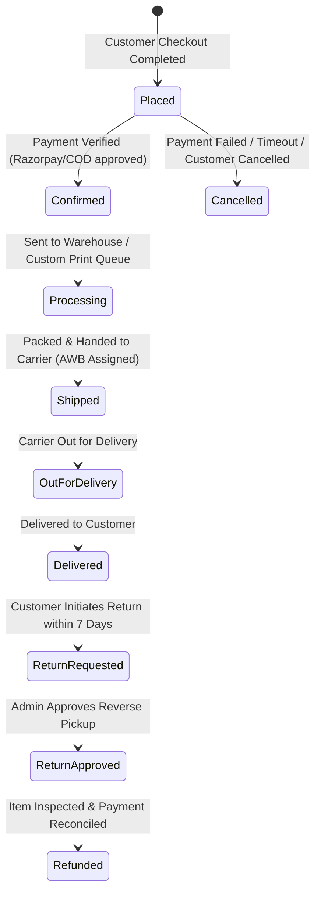
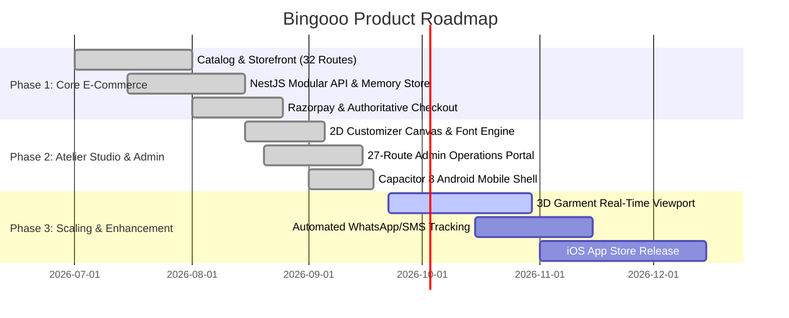

# 📋 BINGOOO — Product Requirements Document (PRD)

> **Document Version:** 1.0.0  
> **Target Release:** v1.0 Production  
> **Status:** Approved / Active Specification  
> **Last Updated:** September 2026  
> **Author:** Bingooo Core Product & Engineering Team  
> **System Repositories:** `apps/frontend`, `apps/admin`, `apps/backend`, `packages/types`, `packages/config`

---

## 1. Executive Summary & Product Vision

### 1.1 Brand Identity & Proposition
**BINGOOO.** (*"Wear what defines you."*) is an atelier-grade Indian menswear and luxury streetwear platform that merges high-density heavyweight apparel with a real-time, bespoke 2D garment customization studio. 

Bingooo bridges the gap between mass-market fast fashion and unaffordable bespoke couture by offering:
1. **Curated Luxury Streetwear Essentials:** Ready-to-wear heavyweight combed cotton t-shirts (240–280 GSM boxy cut), double-layered French terry & fleece hoodies (380–420 GSM), drop-shoulder crewnecks, and tactical cargo trousers.
2. **Interactive Bespoke Customizer Studio:** A browser- and mobile-first 2D design canvas allowing users to customize garments with custom typography, uploaded vector/raster artwork, and choice of print craftsmanship (Direct-to-Garment / DTG vs. High-Density Embroidery vs. Direct-to-Film / DTF).
3. **High-Density Operations & Fulfillment Center:** A 27-route administrative control center orchestrating multi-stage order fulfillment, custom artwork print queues, real-time inventory tracking, Razorpay payment reconciliation, and granular staff RBAC.

### 1.2 Target Channels & Distribution
- **Web Storefront:** Progressive Web App (PWA) built with React 19 + Vite + Tailwind CSS (`apps/frontend`).
- **Native Mobile Experience:** Hybrid Android/iOS app wrapped via Capacitor 8 with native haptics, status bar management, and offline cache.
- **Admin Control Center:** Back-office administrative portal (`apps/admin`) with high-density tabular data and real-time operations telemetry.
- **Backend API:** High-throughput NestJS REST server (`apps/backend`) deployed as serverless functions and containerized microservices.

---

## 2. Target Audience & User Personas

| Persona | Demographics & Profile | Needs & Objectives | Core Pain Points |
|:---|:---|:---|:---|
| **Rahul (The Streetwear Connoisseur)** | Age 19–26, Tier-1 Metro (Bengaluru, Mumbai, Delhi). Follows sneaker drops, appreciates heavy GSM cotton, boxy silhouettes, and drop shoulders. | Wants accurate GSM specifications, fit guide recommendations, authentic lifestyle lookbooks, instant UPI checkout, and rapid parcel tracking. | Thin/cheap fabrics (160 GSM) marketed as "oversized", lack of fabric transparency, slow checkout flows, delayed delivery updates. |
| **Aman (The Creative / Individualist)** | Age 22–32, Graphic Designer / Musician / Content Creator. Seeks unique statement pieces that reflect personal branding. | Intuitive 2D customizer canvas, high-resolution vector artwork upload, multi-font typography engine, accurate price estimator, front/back placement preview. | Clunky customizers with sluggish touch response, inaccurate print area previews, hidden setup fees, poor print longevity. |
| **Kiran (Bulk / B2B / Merchandise Buyer)** | Age 25–40, Startup Founder / College Fest Head / Dance Crew Lead. Needs 20–500 custom garments. | Easy bulk quote submission, artwork review approval, volume discount tiering, transparent DTG vs. Embroidery guidance. | Fragmented WhatsApp-based ordering, lack of formal invoices, uncertainty regarding fabric weight and print durability. |
| **Sneha (Fulfillment & Operations Lead)** | Age 27–35, Warehouse & Production Manager. Coordinates daily print jobs, courier pickups, and inventory. | Centralized 6-stage order fulfillment state machine, downloadable print-ready vector assets, single-click packing slips, low-stock warnings. | Disorganized email/drive links for custom customer art, missed fulfillment SLAs, stock count mismatches. |
| **Mani (Store Owner / Business Admin)** | Age 30+, Brand Director & Finance Controller. | High-level GMV telemetry, conversion rate analytics, coupon and discount campaigns, Razorpay ledger reconciliation, staff role management. | Fragmented tools, unexpected payment gateway chargebacks, lack of audit trails for administrative edits. |

---

## 3. Product Scope & Functional Requirements

### 3.1 Customer Storefront (`apps/frontend`)

#### 3.1.1 Catalog & Product Discovery
- **FR-STORE-001 (Catalog Browsing):** Users can browse apparel categorized into Oversized Tees, Hoodies, Crewnecks, Cargoes, and Seasonal Collections with instant client-side filtering by category, size, color swatch, GSM range, and price ascending/descending.
- **FR-STORE-002 (Product Detail Page - PDP):**
  - High-resolution multi-angle image gallery with interactive thumbnail switching and full-bleed modal zoom.
  - Interactive Size & Fit Matrix (S, M, L, XL, XXL) displaying real-time chest, length, and sleeve measurements with interactive metric/imperial unit toggle.
  - Fabric Specification Badge: Prominent technical callouts including GSM count (e.g., `240 GSM COMBED COTTON`), weave type, shrinkage allowance, and washing guidelines.
  - Real-time Stock Radar: Scarcity badge indicating inventory state (`"In Stock"`, `"Only 3 Left"`, or `"Out of Stock"` with variant-level disabling).
  - Sticky Bottom Action Bar on mobile viewports for direct "Add to Cart" or "Customize This Garment" actions.
- **FR-STORE-003 (Search & Autocomplete):** Live debounced search modal matching product titles, descriptions, categories, and fabric attributes with instant visual previews and recent search persistence.
- **FR-STORE-004 (Recently Viewed & Wishlist):** Client-side persistence of browsed products and heart-toggled wishlist items with synchronization to user account on authentication.

#### 3.1.2 Real-Time Garment Customizer Studio
- **FR-CUST-001 (Garment Canvas Engine):**
  - Interactive 2D garment viewport displaying true-to-silhouette base garments with front and back toggles.
  - Garment Base Color Switcher: Real-time canvas recoloring (Black `#171717`, White `#FFFFFF`, Sand `#D9CBB8`, Stone Grey `#77736D`, Signal Red `#E6321C`).
- **FR-CUST-002 (Typography Engine):**
  - Multi-font typographical text tool supporting 14 curated display fonts (Anton, Bebas Neue, Bungee, Caveat, Cinzel, Cormorant Garamond, Major Mono Display, Permanent Marker, Playfair Display, Prata, Righteous, Russo One, Space Grotesk, Syne).
  - Granular controls: Font size, line height, letter spacing, text color palette, rotation, alignment, and curved text arc generator.
- **FR-CUST-003 (Artwork Upload & Positioning):**
  - Support for PNG, JPG, SVG, and WebP uploads up to 25MB.
  - Canvas boundary clipping ensuring user artwork remains within printable chest, back, or sleeve safety margins.
  - Interactive transformation: Drag to move, pinch/wheel to scale, touch handles for rotation and layering order (Bring to Front, Send to Back).
- **FR-CUST-004 (Craftsmanship & Print Method Selection):**
  - Direct-to-Garment (DTG): Recommended for multi-color photographic artwork and gradients.
  - High-Density Embroidery: Recommended for minimalist chest logos, monograms, and line art (calculates stitch count estimate).
  - Direct-to-Film (DTF): Vibrant, durable transfer prints suited for sportswear graphics.
- **FR-CUST-005 (Dynamic Pricing Calculator):**
  - Real-time price updates based on: Base garment cost + Print Method surcharge + Number of print locations (Front only vs. Front + Back) + Artwork surface area tier.
- **FR-CUST-006 (Design Vault):**
  - Users can save custom configurations to their account vault or local storage, generate shareable links, and download mockups before ordering.

#### 3.1.3 Shopping Bag & Checkout Pipeline
- **FR-CART-001 (Flyout Cart Drawer):**
  - Slide-out cart drawer accessible from any route with live item counter, variant editing, quantity adjustment, and item deletion.
  - Free Shipping Progress Meter: Dynamic bar indicating remaining amount to unlock complimentary pan-India shipping (₹999 threshold).
  - Instant Promo Code Field: Validates promotional coupon codes with instant discount deduction.
- **FR-CHECK-001 (Multi-Step Checkout Flow):**
  - Step 1: Customer Contact (Email & Indian Phone Number with SMS order update opt-in).
  - Step 2: Shipping Address with automated Indian 6-digit PIN code lookup (auto-fills State, City, District).
  - Step 3: Shipping Method Selection (Standard Ground 3–5 days vs. Express Air 1–2 days).
  - Step 4: Authoritative Payment Selection (Razorpay UPI QR/Intent, Credit/Debit Cards, NetBanking, and Cash on Delivery / Partial COD).
- **FR-CHECK-002 (Authoritative Server-Side Pricing):**
  - Absolute enforcement that client cart prices, GST rates (12% for apparel under ₹1000, 18% for apparel above), shipping charges, and discount subtotals are recalculated on the NestJS backend.
- **FR-CHECK-003 (Order Confirmation & Tracking):**
  - Order success receipt with unique `BING-YYYYMMDD-XXXX` order number, downloadable invoice, delivery timeline, and real-time shipment status lookup via phone number / order ID.

---

### 3.2 Back-Office Operations Center (`apps/admin`)

The operations portal is structured into 7 core functional divisions spanning 27 management routes:

| Section | Routes | Key Features & Functional Requirements |
|:---|:---|:---|
| **1. Overview** | `/dashboard` | Executive KPI telemetry (Gross Revenue, Net Orders, Average Order Value, Conversion Rate), 30-day sales velocity charts, low-stock radar, and recent order stream. |
| **2. Catalog & Stock** | `/products`, `/products/new`, `/products/:id/edit`, `/categories`, `/inventory` | Product publishing matrix supporting variant SKU generation (Size × Color), GSM weight specs, care tags, taxonomy category reordering, and warehouse stock reconciliation. |
| **3. Orders & Studio** | `/orders`, `/orders/:id`, `/customizer` | 6-stage order fulfillment state machine (`Placed → Confirmed → Processing → Shipped → Out for Delivery → Delivered`), carrier AWB entry, packing slip generation, and custom print queue with high-res artwork asset downloads. |
| **4. Marketing & Sales**| `/banners`, `/coupons` | Hero banner slider configuration (desktop 16:9 and mobile 4:5 preview cards), discount coupon creation (percentage vs. flat ₹ discount, usage limits, minimum cart spend). |
| **5. Finance & Media** | `/payments`, `/returns`, `/uploads` (R2) | Razorpay transaction reconciliation ledger, reverse logistics and refund management, and Cloudflare R2 media library with instant CDN URL copying. |
| **6. Customers & Team** | `/customers`, `/customers/:id`, `/reviews` | Customer profiles with lifetime spend (LTV), order frequency, customer notes, review moderation board with photo validation and star ratings. |
| **7. Operations & System** | `/settings` | 8-tab system settings: Store Profile, Commerce & GST, Shipping Rules & Tiers, COD & Partial COD thresholds, Razorpay Credentials, Notification Webhooks, Cloudflare R2 Keys, and SEO metadata. |

---

### 3.3 Backend API Server (`apps/backend`)

- **FR-API-001 (Authentication & Authorization):**
  - Customer authentication supporting email/password and Supabase JWT tokens.
  - Role-Based Access Control (RBAC) with `@Roles('admin', 'manager', 'support')` and fine-grained `@Permissions(...)` guards.
- **FR-API-002 (Inventory & Concurrency Control):**
  - Atomic stock reservation during checkout initiation to prevent overselling of limited-run apparel drops.
- **FR-API-003 (Payment Gateway & Webhook Reconciliation):**
  - Razorpay order creation via official SDK.
  - Webhook listener endpoint (`/api/v1/payments/webhook`) capturing raw request buffers to verify HMAC SHA-256 signatures before updating order payment states.
- **FR-API-004 (Cloudflare R2 Object Storage):**
  - Secure presigned PUT URL generation allowing client storefronts and admin portals to upload high-res artwork directly to R2 buckets, eliminating server memory bottlenecks.
- **FR-API-005 (Audit Logging & Compliance):**
  - Structured audit trail recording every administrative modification (price change, order status override, refund trigger) with timestamp, user ID, and IP address.

---

## 4. Non-Functional Requirements (NFRs)

### 4.1 Performance & Scalability
- **NFR-PERF-001 (Core Web Vitals):**
  - Largest Contentful Paint (LCP) ≤ 1.2 seconds on desktop, ≤ 1.8 seconds on 4G mobile.
  - First Input Delay (FID) / Interaction to Next Paint (INP) ≤ 50 milliseconds.
  - Cumulative Layout Shift (CLS) ≤ 0.05.
- **NFR-PERF-002 (API Response Times):**
  - 95th percentile (p95) API response time < 80ms for catalog reads (served from O(1) in-memory hash indexes).
  - 99th percentile (p99) API response time < 250ms for complex checkout and order creation transactions.
- **NFR-PERF-003 (Asset Optimization):**
  - All product and lookbook imagery served in WebP/AVIF formats via CDN with responsive `srcset` and lazy-loading for below-the-fold content.

### 4.2 Security & Defensive Engineering
- **NFR-SEC-001 (Zero Frontend Secrets):** No database credentials, service-role keys, or Razorpay secret keys packaged into client bundles.
- **NFR-SEC-002 (Authoritative Server Pricing):** Frontends submit only product IDs, variant IDs, and quantities; the backend strictly recalculates totals, discounts, taxes, and shipping fees.
- **NFR-SEC-003 (Rate Limiting & Anti-Brute Force):**
  - Global API rate limiting via `@nestjs/throttler`: Burst tier (25 requests / 10s) and Default tier (100 requests / 60s).
  - Strict rate limiting on authentication and checkout endpoints (5 attempts / 60s).
- **NFR-SEC-004 (Security Headers & Sanitization):**
  - Strict Content Security Policy (CSP), HSTS, X-Content-Type-Options, and Frame-Options configured via `helmet`.
  - Global `ValidationPipe` with `whitelist: true` and `forbidNonWhitelisted: true` preventing mass-assignment vulnerabilities.

### 4.3 Reliability & High Availability
- **NFR-REL-001 (Dual Persistence Resilience):**
  - File-backed JSON store with memory indexing for ultra-fast local development and container deployments.
  - Fully mapped Prisma & Supabase PostgreSQL schema with Row-Level Security (RLS) policies for distributed enterprise environments.
- **NFR-REL-002 (Graceful Degradation):**
  - Client-side offline caching via Service Worker allowing browsing of previously loaded products during network interruption.
  - Native fallback handlers when running inside Capacitor Android shells.

---

## 5. User Journeys & State Machines

### 5.1 Order Fulfillment State Machine

---

## 6. Release Phases & Roadmap

---

## 7. Acceptance Criteria & Quality Gates

1. **Storefront Verification:** All 32 routes render without layout shifts, console warnings, or broken link redirects.
2. **Customizer Accuracy:** Exported print specifications match the millimeter positioning selected by the user on the canvas.
3. **Checkout Integrity:** Zero currency rounding discrepancies; automated tests pass for tamper attempts on cart item prices.
4. **Operations Usability:** Admin portal allows order status transitions, AWB assignments, and artwork downloads in under 3 clicks.
5. **Mobile Native Shell:** Android APK builds cleanly via Capacitor, passes splash screen, and delivers tactile vibration on cart interactions.
